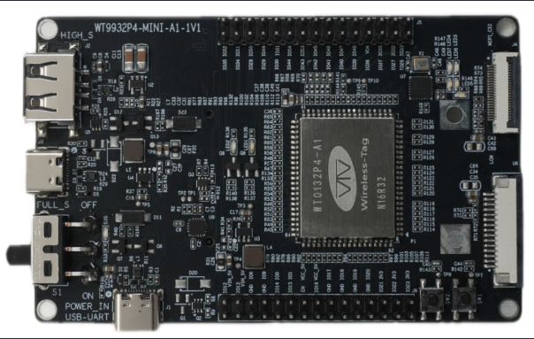

# WT9932P4 Mini A1 示例项目

[英文版本](./README.md)

## 项目简介

这是一个基于WT9932P4_Mini_A1开发板的示例项目。该项目集成了多种功能，包括MIPI DSI显示屏、摄像头、4G CAT.1、以太网等，并支持摄像头的人脸检测和行人检测等功能。

## 主要特性

- 🎯 **智能手机式UI界面** - 基于ESP-Brookesia框架
- 📱 **多种应用程序** - 计算器、摄像头应用
- 🤖 **AI视觉功能** - 人脸检测、行人检测
- 🖥️ **高清显示** - 支持MIPI DSI接口显示屏
- 🌐 **网络连接** - 以太网和4G模块支持
- 📷 **摄像头支持** - 1280x960分辨率摄像头

## 环境搭建

### 硬件要求

- **开发板**: WT9932P4_Mini_A1开发板



- **显示屏**: MIPI DSI接口显示屏(ek79007)
- **摄像头**: OV5647
- **喇叭**: 3W
- **网络选项**: 
  - 以太网PHY (IP101)，带RJ45接口
  - 4G EC20模块（可选）

### 软件环境搭建

#### 1. 安装ESP-IDF

请按照官方文档安装ESP-IDF v5.5(commit:cbe9388f45dd8f33fc560c9727d429e8e107d476)或最新版本：
- [ESP-IDF 入门指南](https://docs.espressif.com/projects/esp-idf/zh_CN/latest/esp32/get-started/index.html)

#### 2. 克隆项目

```bash
git clone <项目仓库地址>
cd phone_wt9932p4_mini_a1
```

#### 3. 配置环境变量

```bash
. ${IDF_PATH}/export.sh
```

#### 4. 安装项目依赖

```bash
# 安装管理的组件依赖
idf.py reconfigure
```

#### 5. 编译和烧录

```bash
# 配置项目
idf.py menuconfig

# 编译项目
idf.py build

# 烧录到设备
idf.py flash

# 查看串口输出
idf.py monitor
```

## 网络连接选项

### 以太网使用 (需要外接扩展板)

#### 说明

- 开发板集成了以太网PHY (IP101)和RJ45接口
- 支持标准的10/100 Mbps以太网连接
- 通过DHCP自动配置

#### 引脚配置

以太网接口使用以下引脚：
- **MDC**: GPIO 31
- **MDIO**: GPIO 52
- **PHY Reset**: GPIO 51
- **PHY Address**: 1

#### 使用

在menuconfig中启用以太网支持：

```bash
(Top) → Example Configuration → Use eth demo
```

### 4G模块使用（可选）

#### 说明

- 支持通过USB接口连接4G EC20模块
- 提供蜂窝网络连接
- 包含网络测试ping功能

#### 配置

在menuconfig中启用4G支持：

```bash
(Top) → Example Configuration → Use 4G EC20 demo
```

## 工程目录介绍

```
phone_wt9932p4_mini_a1/
├── main/                           # 主程序源码
│   ├── main.cpp                    # 程序入口点
│   ├── CMakeLists.txt              # 主程序构建配置
│   └── idf_component.yml           # 组件依赖配置
├── components/                     # 自定义组件
│   ├── apps/                       # 应用程序组件
│   │   ├── calculator/             # 计算器应用
│   │   └── camera/                 # 摄像头应用
│   ├── human_face_detect/          # 人脸检测组件
│   └── pedestrian_detect/          # 行人检测组件
├── CMakeLists.txt                  # 顶层构建配置
├── sdkconfig.defaults              # 默认SDK配置
├── partitions.csv                  # 分区表配置
└── README.md                       # 项目说明文档
```

### 核心组件说明

#### 1. 主程序 (`main/`)
- **main.cpp**: 程序入口，初始化系统、显示、存储、网络等模块，并启动各个应用程序

#### 2. 应用程序 (`components/apps/`)
- **calculator/**: 计算器应用，支持基本四则运算
- **camera/**: 摄像头应用，支持拍照和视频预览

#### 3. AI视觉组件
- **human_face_detect/**: 人脸检测算法实现
- **pedestrian_detect/**: 行人检测算法实现

## 分区配置

>[!INFO]
>**自定义分区表说明 (`partitions.csv`)**
>- **nvs** (24KB): 非易失性存储，用于配置数据
>- **phy_init** (4KB): RF校准数据
>- **factory** (9MB): 应用程序固件

## 开发调试

### 查看日志
```bash
idf.py monitor
```

### 常用配置项
通过 `idf.py menuconfig` 可以配置：
- 显示屏参数设置
- 摄像头分辨率配置
- 网络配置（以太网、4G）

## 组件库版本要求

### 核心框架依赖
| 组件名称 | 版本要求 | 描述 |
|---------|---------|------|
| **ESP-IDF** | v5.5.0 (commit: cbe9388f45dd8f33fc560c9727d429e8e107d476) | ESP32开发框架 |
| **espressif/esp-brookesia** | 0.4.2 | 智能手机式UI框架 |
| **lvgl/lvgl** | 8.4.0 | 轻量级图形库 |
| **espressif/esp_lvgl_port** | 2.6.0 | LVGL移植层 |

### 显示屏和触摸组件
| 组件名称 | 版本要求 | 目标芯片 | 描述 |
|---------|---------|----------|------|
| **espressif/esp_lcd_ek79007** | 1.0.2 | ESP32P4 | EK79007显示屏驱动 |
| **espressif/esp_lcd_ili9881c** | 1.0.1 | ESP32P4 | ILI9881C显示屏驱动 |
| **espressif/esp_lcd_lt8912b** | 0.1.1 | ESP32P4 | LT8912B (MIPI DSI-HDMI)显示屏驱动 |
| **espressif/esp_lcd_touch** | 1.1.2 | 通用 | 触摸屏基础驱动 |
| **espressif/esp_lcd_touch_gt911** | 1.1.3 | 通用 | GT911触摸控制器 |

### 摄像头组件
| 组件名称 | 版本要求 | 目标芯片 | 描述 |
|---------|---------|----------|------|
| **espressif/esp_cam_sensor** | 0.9.0 | ESP32P4 | 摄像头传感器驱动 |
| **espressif/esp_sccb_intf** | 0.0.5 | 通用 | SCCB接口驱动 |

### 视频和编解码器组件
| 组件名称 | 版本要求 | 目标芯片 | 描述 |
|---------|---------|----------|------|
| **espressif/esp_video** | 0.8.0~3 | ESP32P4 | 视频处理框架 |
| **espressif/esp_h264** | 1.1.2 | ESP32S3/P4 | H.264编解码器 |
| **espressif/esp_jpeg** | 1.3.0 | 通用 | JPEG解码器 |
| **espressif/esp_codec_dev** | 1.2.0 | 通用 | 音频编解码器设备支持 |
| **espressif/esp_ipa** | 0.2.0 | ESP32P4 | 图像处理加速器 |

### AI和深度学习组件
| 组件名称 | 版本要求 | 目标芯片 | 描述 |
|---------|---------|----------|------|
| **espressif/esp-dl** | 3.1.0 | ESP32S3/P4 | ESP深度学习推理框架 |

### 网络和通信组件
| 组件名称 | 版本要求 | 目标芯片 | 描述 |
|---------|---------|----------|------|
| **espressif/eppp_link** | 0.3.1 | 通用 | PPP协议链接 |
| **espressif/esp_serial_slave_link** | 1.1.0~1 | 通用 | 串行从设备链接 |
| **espressif/iot_usbh_modem** | 1.2.0 | ESP32P4 | USB调制解调器板支持 |
| **espressif/iot_usbh_cdc** | 2.0.1 | ESP32S2/S3/P4 | USB主机CDC驱动 |
| **espressif/esp_hosted** | 2.0.13 | 通用 | ESP-Hosted MCU驱动 |
| **espressif/esp_wifi_remote** | 0.14.3 | 通用 | WiFi远程功能封装 |

### 板级支持包
| 组件名称 | 版本要求 | 目标芯片 | 描述 |
|---------|---------|----------|------|
| **espressif/esp32_p4_function_ev_board** | 5.0.0~1 | ESP32P4 | ESP32-P4功能评估板BSP |

### 工具和实用组件
| 组件名称 | 版本要求 | 描述 |
|---------|---------|------|
| **espressif/cmake_utilities** | 0.5.3 | CMake构建工具 |
| **espressif/json_parser** | 1.0.3 | JSON解析器 |
| **espressif/jsmn** | 1.1.0 | 轻量级JSON解析器 |

### 版本兼容性说明

>[!IMPORTANT]
>**关键版本要求**
>1. **ESP-IDF版本**: 建议使用v5.5特定commit版本，以确保所有组件的兼容性
>2. **目标芯片**: 主要针对ESP32P4芯片，部分组件也支持ESP32S3
>3. **依赖关系**: 某些组件存在相互依赖关系，请确保版本匹配

>[!CAUTION]
>**更新注意**: 升级组件版本时，请检查依赖关系和兼容性，避免出现不兼容问题

### 安装指定版本组件

如需安装特定版本的组件，可以在`idf_component.yml`中指定：

```yaml
dependencies:
  espressif/esp-brookesia:
    version: "0.4.2"
  espressif/esp_video:
    version: "0.8.0~3"
    rules:
      - if: "target == esp32p4"
```

## 日志输出

```bash
ESP-ROM:esp32p4-eco2-20240710
Build:Jul 10 2024
rst:0x1 (POWERON),boot:0x10f (SPI_FAST_FLASH_BOOT)
SPI mode:DIO, clock div:1
load:0x4ff33ce0,len:0x17a4
load:0x4ff29ed0,len:0xf28
--- 0x4ff29ed0: esp_bootloader_get_description at /home/ferry/esp/idf55/components/esp_bootloader_format/esp_bootloader_desc.c:39

load:0x4ff2cbd0,len:0x3454
--- 0x4ff2cbd0: esp_flash_encryption_enabled at /home/ferry/esp/idf55/components/bootloader_support/src/flash_encrypt.c:89

entry 0x4ff29eda
--- 0x4ff29eda: call_start_cpu0 at /home/ferry/esp/idf55/components/bootloader/subproject/main/bootloader_start.c:25

I (25) boot: ESP-IDF v5.5-beta1-204-gcbe9388f45 2nd stage bootloader
I (26) boot: compile time Jul  7 2025 17:54:32
I (26) boot: Multicore bootloader
I (29) boot: chip revision: v1.0
I (30) boot: efuse block revision: v0.3
I (34) qio_mode: Enabling default flash chip QIO
I (38) boot.esp32p4: SPI Speed      : 80MHz
I (42) boot.esp32p4: SPI Mode       : QIO
I (46) boot.esp32p4: SPI Flash Size : 16MB
I (50) boot: Enabling RNG early entropy source...
I (54) boot: Partition Table:
I (57) boot: ## Label            Usage          Type ST Offset   Length
I (63) boot:  0 nvs              WiFi data        01 02 00009000 00006000
I (70) boot:  1 phy_init         RF data          01 01 0000f000 00001000
I (76) boot:  2 factory          factory app      00 00 00010000 00900000
I (84) boot: End of partition table
I (86) esp_image: segment 0: paddr=00010020 vaddr=481b0020 size=305548h (3167560) map
I (578) esp_image: segment 1: paddr=00315570 vaddr=30100000 size=00088h (   136) load
I (580) esp_image: segment 2: paddr=00315600 vaddr=4ff00000 size=0aa18h ( 43544) load
I (591) esp_image: segment 3: paddr=00320020 vaddr=48000020 size=1a9a60h (1743456) map
I (859) esp_image: segment 4: paddr=004c9a88 vaddr=4ff0aa18 size=11830h ( 71728) load
I (874) esp_image: segment 5: paddr=004db2c0 vaddr=4ff1c280 size=03840h ( 14400) load
I (878) esp_image: segment 6: paddr=004deb08 vaddr=50108080 size=00020h (    32) load
I (886) boot: Loaded app from partition at offset 0x10000
I (886) boot: Disabling RNG early entropy source...
I (899) hex_psram: vendor id    : 0x0d (AP)
I (899) hex_psram: Latency      : 0x01 (Fixed)
I (900) hex_psram: DriveStr.    : 0x00 (25 Ohm)
I (900) hex_psram: dev id       : 0x03 (generation 4)
I (905) hex_psram: density      : 0x07 (256 Mbit)
I (909) hex_psram: good-die     : 0x06 (Pass)
I (913) hex_psram: SRF          : 0x02 (Slow Refresh)
I (918) hex_psram: BurstType    : 0x00 ( Wrap)
I (922) hex_psram: BurstLen     : 0x03 (2048 Byte)
I (927) hex_psram: BitMode      : 0x01 (X16 Mode)
I (931) hex_psram: Readlatency  : 0x04 (14 cycles@Fixed)
I (936) hex_psram: DriveStrength: 0x00 (1/1)
I (941) MSPI DQS: tuning success, best phase id is 0
I (1113) MSPI DQS: tuning success, best delayline id is 16
I esp_psram: Found 32MB PSRAM device
I esp_psram: Speed: 200MHz
I (1265) mmu_psram: .rodata xip on psram
I (1348) mmu_psram: .text xip on psram
I (1348) hex_psram: psram CS IO is dedicated
I (1349) cpu_start: Multicore app
I (1740) esp_psram: SPI SRAM memory test OK
I (1749) cpu_start: Pro cpu start user code
I (1749) cpu_start: cpu freq: 360000000 Hz
I (1750) app_init: Application information:
I (1750) app_init: Project name:     wt9932p4_mini_a1
I (1754) app_init: App version:      1.0.1
I (1758) app_init: Compile time:     Jul  7 2025 17:54:12
I (1763) app_init: ELF file SHA256:  78740a42f...
I (1768) app_init: ESP-IDF:          v5.5-beta1-204-gcbe9388f45
I (1773) efuse_init: Min chip rev:     v0.1
I (1777) efuse_init: Max chip rev:     v1.99 
I (1781) efuse_init: Chip rev:         v1.0
I (1785) heap_init: Initializing. RAM available for dynamic allocation:
I (1792) heap_init: At 4FF227C0 len 00018800 (98 KiB): RAM
I (1797) heap_init: At 4FF3AFC0 len 00004BF0 (18 KiB): RAM
I (1802) heap_init: At 4FF40000 len 00040000 (256 KiB): RAM
I (1808) heap_init: At 501080A0 len 00007F60 (31 KiB): RTCRAM
I (1813) heap_init: At 30100088 len 00001F78 (7 KiB): TCM
I (1818) esp_psram: Adding pool of 27904K of PSRAM memory to heap allocator
I (1825) esp_psram: Adding pool of 25K of PSRAM memory gap generated due to end address alignment of irom to the heap allocator
I (1836) esp_psram: Adding pool of 42K of PSRAM memory gap generated due to end address alignment of drom to the heap allocator
I (1847) spi_flash: detected chip: generic
I (1851) spi_flash: flash io: qio
I (1854) host_init: ESP Hosted : Host chip_ip[18]
I (1868) H_API: ESP-Hosted starting. Hosted_Tasks: prio:23, stack: 5120 RPC_task_stack: 5120
sdio_mempool_create free:28769416 min-free:28769416 lfb-def:28311552 lfb-8bit:28311552

I (1875) H_API: ** add_esp_wifi_remote_channels **
I (1879) transport: Add ESP-Hosted channel IF[1]: S[0] Tx[0x4800cc1c] Rx[0x4801bb26]
--- 0x4800cc1c: transport_drv_sta_tx at /home/ferry/workpro/phone_wt9932p4_mini_a1/managed_components/espressif__esp_hosted/host/drivers/transport/transport_drv.c:219
--- 0x4801bb26: esp_wifi_remote_channel_rx at /home/ferry/workpro/phone_wt9932p4_mini_a1/managed_components/espressif__esp_wifi_remote/esp_wifi_remote_net.c:19

I (1886) transport: Add ESP-Hosted channel IF[2]: S[0] Tx[0x4800cb62] Rx[0x4801bb26]
--- 0x4800cb62: transport_drv_ap_tx at /home/ferry/workpro/phone_wt9932p4_mini_a1/managed_components/espressif__esp_hosted/host/drivers/transport/transport_drv.c:249
--- 0x4801bb26: esp_wifi_remote_channel_rx at /home/ferry/workpro/phone_wt9932p4_mini_a1/managed_components/espressif__esp_wifi_remote/esp_wifi_remote_net.c:19

I (1894) main_task: Started on CPU0
I (1897) main_task: Calling app_main()
I (1904) modem_board: iot_usbh_modem, version: 1.2.0
I (1905) modem_board: Force reset modem board....
I (1909) modem_board: Resetting modem using io=5, level=1
I (2115) modem_board: Waiting for modem initialize ready
I (7115) USBH_CDC: iot usbh cdc version: 2.0.1
I (7145) esp-modem: --------- Modem PreDefined Info ------------------
I (7145) esp-modem: Model: EC20_CE
I (7145) esp-modem: Modem itf 2
I (7146) esp-modem: ----------------------------------------------------
W (7533) EXT_HUB: Transaction Translator has not been implemented yet
W (7533) EXT_HUB: Device has several Interfaces, selection has not been implemented yet. Using first.
Found NOTIF endpoint: 133
Found IN endpoint: 132
Found OUT endpoint: 3
*** Device descriptor ***
bLength 18
bDescriptorType 1
bcdUSB 2.00
bDeviceClass 0xef
bDeviceSubClass 0x2
bDeviceProtocol 0x1
bMaxPacketSize0 64
idVendor 0x2c7c
idProduct 0x125
bcdDevice 3.10
iManufacturer 1
iProduct 2
iSerialNumber 3
bNumConfigurations 1
*** Configuration descriptor ***
bLength 9
bDescriptorType 2
wTotalLength 209
bNumInterfaces 5
bConfigurationValue 1
iConfiguration 0
bmAttributes 0xa0
bMaxPower 500mA
        *** Interface descriptor ***
        bLength 9
        bDescriptorType 4
        bInterfaceNumber 0
        bAlternateSetting 0
        bNumEndpoints 2
        bInterfaceClass 0xff
        bInterfaceSubClass 0xff
        bInterfaceProtocol 0xff
        iInterface 0
                *** Endpoint descriptor ***
                bLength 7
                bDescriptorType 5
                bEndpointAddress 0x81   EP 1 IN
                bmAttributes 0x2        BULK
                wMaxPacketSize 512
                bInterval 0
                *** Endpoint descriptor ***
                bLength 7
                bDescriptorType 5
                bEndpointAddress 0x1    EP 1 OUT
                bmAttributes 0x2        BULK
                wMaxPacketSize 512
                bInterval 0
        *** Interface descriptor ***
        bLength 9
        bDescriptorType 4
        bInterfaceNumber 1
        bAlternateSetting 0
        bNumEndpoints 3
        bInterfaceClass 0xff
        bInterfaceSubClass 0x0
        bInterfaceProtocol 0x0
        iInterface 0
                *** Endpoint descriptor ***
                bLength 7
                bDescriptorType 5
                bEndpointAddress 0x83   EP 3 IN
                bmAttributes 0x3        INT
                wMaxPacketSize 10
                bInterval 9
                *** Endpoint descriptor ***
                bLength 7
                bDescriptorType 5
                bEndpointAddress 0x82   EP 2 IN
                bmAttributes 0x2        BULK
                wMaxPacketSize 512
                bInterval 0
                *** Endpoint descriptor ***
                bLength 7
                bDescriptorType 5
                bEndpointAddress 0x2    EP 2 OUT
                bmAttributes 0x2        BULK
                wMaxPacketSize 512
                bInterval 0
        *** Interface descriptor ***
        bLength 9
        bDescriptorType 4
        bInterfaceNumber 2
        bAlternateSetting 0
        bNumEndpoints 3
        bInterfaceClass 0xff
        bInterfaceSubClass 0x0
        bInterfaceProtocol 0x0
        iInterface 0
                *** Endpoint descriptor ***
                bLength 7
                bDescriptorType 5
                bEndpointAddress 0x85   EP 5 IN
                bmAttributes 0x3        INT
                wMaxPacketSize 10
                bInterval 9
                *** Endpoint descriptor ***
                bLength 7
                bDescriptorType 5
                bEndpointAddress 0x84   EP 4 IN
                bmAttributes 0x2        BULK
                wMaxPacketSize 512
                bInterval 0
                *** Endpoint descriptor ***
                bLength 7
                bDescriptorType 5
                bEndpointAddress 0x3    EP 3 OUT
                bmAttributes 0x2        BULK
                wMaxPacketSize 512
                bInterval 0
        *** Interface descriptor ***
        bLength 9
        bDescriptorType 4
        bInterfaceNumber 3
        bAlternateSetting 0
        bNumEndpoints 3
        bInterfaceClass 0xff
        bInterfaceSubClass 0x0
        bInterfaceProtocol 0x0
        iInterface 0
                *** Endpoint descriptor ***
                bLength 7
                bDescriptorType 5
                bEndpointAddress 0x87   EP 7 IN
                bmAttributes 0x3        INT
                wMaxPacketSize 10
                bInterval 9
                *** Endpoint descriptor ***
                bLength 7
                bDescriptorType 5
                bEndpointAddress 0x86   EP 6 IN
                bmAttributes 0x2        BULK
                wMaxPacketSize 512
                bInterval 0
                *** Endpoint descriptor ***
                bLength 7
                bDescriptorType 5
                bEndpointAddress 0x4    EP 4 OUT
                bmAttributes 0x2        BULK
                wMaxPacketSize 512
                bInterval 0
        *** Interface descriptor ***
        bLength 9
        bDescriptorType 4
        bInterfaceNumber 4
        bAlternateSetting 0
        bNumEndpoints 3
        bInterfaceClass 0xff
        bInterfaceSubClass 0xff
        bInterfaceProtocol 0xff
        iInterface 0
                *** Endpoint descriptor ***
                bLength 7
                bDescriptorType 5
                bEndpointAddress 0x89   EP 9 IN
                bmAttributes 0x3        INT
                wMaxPacketSize 8
                bInterval 9
                *** Endpoint descriptor ***
                bLength 7
                bDescriptorType 5
                bEndpointAddress 0x88   EP 8 IN
                bmAttributes 0x2        BULK
                wMaxPacketSize 512
                bInterval 0
                *** Endpoint descriptor ***
                bLength 7
                bDescriptorType 5
                bEndpointAddress 0x5    EP 5 OUT
                bmAttributes 0x2        BULK
                wMaxPacketSize 512
                bInterval 0
I (12672) modem_board: DTE reconnect, reconnecting ...

I (12677) main: Modem Board Event: USB connected
I (12681) USBH_CDC: Opened cdc device: 2
I (12685) USBH_CDC: New device connected, address: 2
I (13677) modem_board: reconnect after 5s...
I (14677) modem_board: reconnect after 4s...
I (15677) modem_board: reconnect after 3s...
I (16677) modem_board: reconnect after 2s...
I (17677) modem_board: reconnect after 1s...
I (17677) modem_board: Modem state STAGE_SYNC, Start
E (17694) esp-modem-dte: esp_dte_handle_line(79): handle line failed
I (17694) modem_board: Network Auto reconnecting ...
I (17694) modem_board: Modem state STAGE_SYNC, Success!
W (17694) main: Modem Board Event: Network disconnected
I (17799) modem_board: Modem state STAGE_CHECK_SIM, Start
I (17805) modem_board: SIM Card Ready
I (17805) modem_board: Modem state STAGE_CHECK_SIM, Success!
I (17805) main: Modem Board Event: SIM Card Connected
I (17905) modem_board: Modem state STAGE_CHECK_SIGNAL, Start
I (17908) modem_board: Signal quality: rssi=11, ber=99
I (17908) modem_board: Modem state STAGE_CHECK_SIGNAL, Success!
I (18009) modem_board: Modem state STAGE_CHECK_REGIST, Start
I (18014) modem_board: Network registered, Operator: "CHN-CT"
I (18014) modem_board: Modem state STAGE_CHECK_REGIST, Success!
I (18114) modem_board: Modem state STAGE_START_PPP, Start
I (18131) modem_board: Modem state STAGE_START_PPP, Success!
I (18231) modem_board: Modem state STAGE_WAIT_IP, Start
W (18231) modem_board: Modem event! 0
I (18460) esp-netif_lwip-ppp: ppp: Connected
I (18460) modem_board: IP event! 6
I (18460) modem_board: Modem Connected to PPP Server
I (18461) modem_board: ppp ip: 10.47.107.47, mask: 255.255.255.255, gw: 10.64.64.64
I (18468) modem_board: Main DNS: 202.96.128.86
I (18472) modem_board: Backup DNS: 202.96.134.133
I (18477) modem_board: Modem state STAGE_WAIT_IP, Success!
I (18477) esp-modem-netif: PPP state changed event 0: (NETIF_PPP_ERRORNONE)
I (18489) main: Modem Board Event: Network connected
I (18523) esp_eth.netif.netif_glue: 30:ed:a0:e0:ce:3a
I (18523) esp_eth.netif.netif_glue: ethernet attached to netif
I (20424) main: Ethernet Started
I (20424) LVGL: Starting LVGL task
I (20424) main: Ethernet Link Up
I (20424) main: Ethernet HW Addr 30:ed:a0:e0:ce:3a
W (20426) ledc: GPIO 26 is not usable, maybe conflict with others
I (20432) ESP32_P4_EV: MIPI DSI PHY Powered on
I (20437) ESP32_P4_EV: Install MIPI DSI LCD control panel
I (20441) ESP32_P4_EV: Install EK79007 LCD control panel
I (20446) ek79007: version: 1.0.2
I (20613) ESP32_P4_EV: Display initialized
I (20613) ESP32_P4_EV: Display resolution 1024x600
E (20614) lcd_panel: esp_lcd_panel_swap_xy(50): swap_xy is not supported by this panel
W (20618) i2c.master: Please check pull-up resistances whether be connected properly. Otherwise unexpected behavior would happen. For more detailed information, please read docs
I (20633) GT911: I2C address initialization procedure skipped - using default GT9xx setup
I (20641) GT911: TouchPad_ID:0x39,0x31,0x31
I (20645) GT911: TouchPad_Config_Version:89
I (20649) ESP32_P4_EV: Setting LCD backlight: 100%
[WARN] [esp_brookesia_core.cpp:46](getDisplaySize): Display is not set, use default display
[INFO] [esp_brookesia_core.cpp:204](beginCore): Library version: 0.4.1
[WARN] [esp_brookesia_phone_manager.cpp:72](begin): No touch device is set, try to use default touch device
[WARN] [esp_brookesia_phone_manager.cpp:76](begin): Using default touch device(@0x0x484b742c)
I (20707) ov5647: Detected Camera sensor PID=0x5647
I (20769) app_video: version: 0.8.0
I (20769) app_video: driver:  MIPI-CSI
I (20769) app_video: card:    MIPI-CSI
I (20769) app_video: bus:     esp32p4:MIPI-CSI
I (20772) app_video: width=1280 height=960
I (20788) app_camera_pipeline: new elements[0]:0x48e20d04, internal:1
I (20800) app_camera_pipeline: new elements[1]:0x48fe8d08, internal:1
I (20812) app_camera_pipeline: new elements[2]:0x491b0d0c, internal:1
I (20824) app_camera_pipeline: new elements[3]:0x49378d10, internal:1
I (20825) app_camera_pipeline: new pipeline 0x484b9388, elem_num:4
I (20826) app_camera_pipeline: new elements[0]:0x484b9498, internal:1
I (20832) app_camera_pipeline: new elements[1]:0x484b94ec, internal:1
I (20838) app_camera_pipeline: new elements[2]:0x484b9540, internal:1
I (20844) app_camera_pipeline: new elements[3]:0x484b9594, internal:1
I (20850) app_camera_pipeline: new pipeline 0x484b9410, elem_num:4

I (23552) modem_board: IP event! 4
I (23552) esp_netif_handlers: eth ip: 192.168.10.211, mask: 255.255.255.0, gw: 192.168.10.15
I (23552) main: Ethernet Got IP Address
I (23555) main: ~~~~~~~~~~~
I (23558) main: ETHIP:192.168.10.211
I (23561) main: ETHMASK:255.255.255.0
I (23565) main: ETHGW:192.168.10.15
I (23568) main: ~~~~~~~~~~~
I (30860) main: Ping addr 8.8.8.8 Restart..
I (30871) main: 64 bytes from 8.8.8.8 icmp_seq=1 ttl=114 time=11 ms
```
